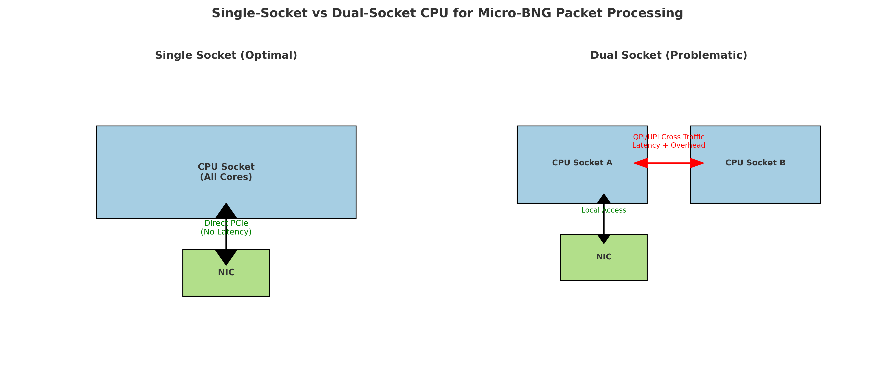

# Why a Single CPU Socket with Higher Clock Speed Outperforms Dual-Socket Systems for Micro-BNG

When it comes to building high-performance **virtual Broadband Network Gateways (Micro-BNG)**, hardware choice is critical. Many engineers assume that adding more CPUs (dual-socket systems) automatically means better performance. In reality, for packet processing workloads like Micro-BNG built on **VPP (Vector Packet Processing) and DPDK**, the opposite is often true.

In this article, we’ll explore why **a single CPU socket with maximum cores, higher clock speed, and strong per-core performance** is better than dual-socket architectures for Micro-BNG, and how NUMA architecture plays a crucial role in this decision.

---

## Understanding the Problem with Dual-Socket Systems

Modern servers often feature **dual-socket CPUs**. Each socket has its own memory controller and PCIe lanes, and they communicate through an interconnect bus (Intel QPI / UPI, AMD Infinity Fabric).

Here’s the catch:  
- The **NIC (Network Interface Card)** is physically connected to one CPU socket via PCIe.  
- If packet interrupts or vBNG worker threads run on the **other CPU socket**, every packet must travel across the interconnect bus.  
- This adds **latency, memory access penalties, and CPU overhead**.  

For high-throughput applications like Micro-BNG, where packets need to be processed at line rate (10G/40G/100G+), this cross-socket communication can cut performance by **30–50%**.

> In simpler terms: one CPU is “closer” to the NIC. If you split the workload across sockets, you create a bottleneck at the interconnect.

---

## Why a Single CPU Socket Wins

### 1. NUMA Locality Matters
NUMA (Non-Uniform Memory Access) means each socket has its own “local” memory. Accessing local memory is fast, but accessing memory on the other socket is slow.  
- With a single socket, **all cores share the same local memory and PCIe lanes** → no NUMA penalties.  
- With dual sockets, packet buffers often cross sockets → performance suffers.  

### 2. Simpler Interrupt Handling
NIC interrupts (Rx/Tx queues) should always be handled by the same CPU socket that owns the NIC. With one socket, this is straightforward. With two sockets, IRQ affinity must be manually managed, and mistakes can cripple throughput.  

### 3. Better Cache Utilization
Micro-BNG packet processing is highly cache-dependent. A single CPU socket ensures:  
- Larger shared L3 cache pool  
- Less cache-coherency traffic across sockets  
- Lower latency per packet  

### 4. No QPI/UPI Bottleneck
In dual-socket systems, packets crossing sockets must travel over QPI/UPI. This interconnect becomes the bottleneck at high packet-per-second (PPS) loads. With one socket, this problem simply doesn’t exist.  

---

## Why Clock Speed and Per-Core Performance Matter

Unlike generic cloud applications, Micro-BNG performance isn’t about how many threads you can run—it’s about **how fast each core can process packets**.

- **Higher Clock Speed:** Faster CPU cycles mean lower packet latency and higher PPS capacity.  
- **Per-Core Performance (IPC):** VPP and DPDK are single-threaded per worker. Each worker is pinned to a CPU core. Strong single-core performance ensures each worker can push more packets.  
- **Scaling with Cores:** A single socket with 32–64 high-performance cores scales linearly when each core runs a vBNG worker.  

Example:  
- A **64-core AMD EPYC (single socket, 2.6–3.0 GHz)** can outperform a **dual 22-core Intel Xeon (2.2 GHz each)** because all cores are local, faster, and avoid NUMA overhead.  

---

## Micro-BNG’s Packet Processing Reality

Micro-BNG relies on **VPP workers** to handle PPPoE, NAT44, QoS, and routing at line speed. Here’s how the architecture ties into CPU design:

1. **NIC queues are mapped directly to CPU cores** → better when all cores belong to the same socket.  
2. **VPP Workers pin to specific cores** → higher clock speed = higher per-worker PPS.  
3. **Control plane (Accel-PPP, RADIUS, ACS, etc.)** runs on separate non-isolated cores, but doesn’t require massive parallelization.  

By choosing a single, strong CPU socket:  
- You eliminate **cross-socket memory transfers**.  
- You reduce **latency spikes**.  
- You maximize **packet throughput** per core.  

---

## Practical Recommendations

- Prefer **1× CPU with more cores and higher clock speed** instead of 2× slower CPUs.  
- Always check NUMA mapping with:  
  ```bash
  numactl --hardware
  ```  
- Bind NIC interrupts to the correct socket (disable `irqbalance`):  
  ```bash
  systemctl stop irqbalance
  systemctl disable irqbalance
  /usr/sbin/set_irq_affinity_bynode.sh $(cat /sys/class/net/ethX/device/numa_node) ethX
  ```  
- Pin VPP workers to local cores only:  
  ```bash
  taskset -c <core_list> vpp
  ```  

---

## Conclusion

For Micro-BNG deployments, the myth of “more CPUs = more performance” does not hold true. Instead, the ideal setup is:  

- **One CPU socket** (no NUMA penalty, no QPI/UPI bottleneck)  
- **Maximum cores on that socket** (to scale VPP workers)  
- **High clock speed & strong per-core performance** (to maximize PPS per worker)  

This combination ensures that Micro-BNG can process packets at wire speed, maintain low latency, and deliver carrier-grade stability—without being choked by architecture limitations.  

---

## Visual: Single-Socket vs Dual-Socket



---

👉 If you’re planning a Micro-BNG deployment and want to discuss optimized hardware setups, feel free to reach out to us at **Netgroot Infotech Pvt. Ltd.**
